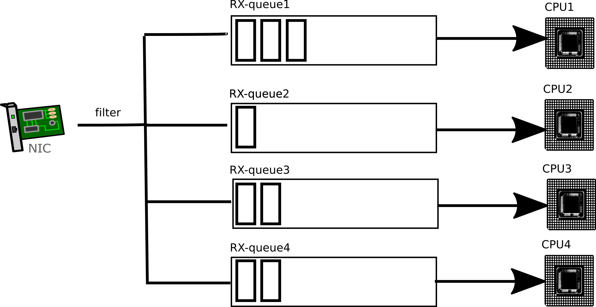

# $B%M%C%H%o!<%/%9%?%C%/$K$*$1$k%9%1!<%k(B

$B$3$l$i$NMQ8l$N0UL#$d5!G=$r@5$7$/2!$5$($F$*$/I,MW$,$"$j$^$9!#(B

- RSS: Receive Side Scaling
- RPS: Receive Packet Steering
- RFS: Receive Flow Steering
- Accelerated Receive Flow Steering
- XPS: Transmit Packet Steering

### Recieve Side Scaling(RSS)$B$K$D$$$F(B
$B:G6a$N(BNIC$B$K$*$$$F$O(BH/W$B$NCf$GAw<u?.MQ$N%-%e!<$rJ];}$7$F$$$^$9!#(B
$B$3$N;EAH$_$rMxMQ$9$k$3$H$K$h$C$F!"DL>o$O(B1$B$D$N(BCPU$B$G9T$&<u?.@)8f$rJ#?t$N(BCPU$B$G9T$&$3$H$,$G$-$^$9!#(B


/proc/irq/<irq>/smp_affinity$B$K$h$C$F(B

### Receive Packet Steering
RSS$B$N5!G=$G(BNIC$BCf$N(Bqueue$B$+$i3F(BCPU$B$KJ,;6$5$l$k$H!"$=$N(BCPU$B$+$i(Bbacklog$B$KEPO?$5$l$^$9!#(B


```
$ 
ethtool
-
S ens1f0 | grep '
rx_queue
_.*_packets'
rx_queue_0_packets: 198005155
rx_queue_1_packets: 153339750
rx_queue_2_packets: 162870095
rx_queue_3_packets: 172303801
rx_queue_4_packets: 153728776
rx_queue_5_packets: 158138563
rx_queue_6_packets: 164411653
rx_queue_7_packets: 165924489
rx_queue_8_packets: 176545406
rx_queue_9_packets: 165340188
rx_queue_10_packets: 150279834
rx_queue_11_packets: 150983782
rx_queue_12_packets: 157623687
rx_queue_13_packets: 150743910
rx_queue_14_packets: 158634344
rx_queue_15_packets: 158497890
rx_queue_16_packets: 4
rx_queue_17_packets: 3
rx_queue_18_packets: 0
rx_queue_19_packets: 8
```

### 


# $B;29M(BURL
- https://www.kernel.org/doc/Documentation/networking/scaling.txt
- Boost UDP Transaction Performance
  - http://events.linuxfoundation.jp/sites/events/files/slides/LinuxConJapan2016_makita_160714.pdf
